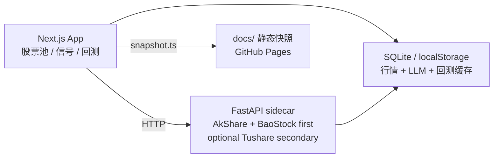

# topkyo · AI 基建研究台

个人 AI 基建主题 A 股研究仪表盘。项目聚焦算力、互连、散热、电力、IDC、存储、半导体设备与材料等供给侧方向，用于维护股票池、查看行情和一致预期参考、生成 LLM 策略信号，并做滚动回测。

> 个人研究工具，不构成任何投资建议。
> 基于 [madeye/silicon-civilization-stock-trade](https://github.com/madeye/silicon-civilization-stock-trade) fork 后定制。

静态展示页：<https://topkyo.github.io/topkyo-ai-infra-dashboard/>

## 核心能力

| 能力 | 说明 |
|---|---|
| AI 基建股票池 | 按子主题维护 A 股标的，数据在 [web/data/universe.json](web/data/universe.json)。 |
| 行情与一致预期 | FastAPI sidecar 拉取现价、估值、分析师评级和隐含目标参考。 |
| LLM 策略信号 | 规则特征先做候选预筛，入围标的由 LLM 决定 buy / hold / sell；同步页面超时时保守 hold。 |
| 严格回测 | 按调仓周期严格重配，支持基准指数、单边费率、信号缓存和结果存档。 |
| 多层缓存 | 浏览器、Python sidecar、LLM 响应、回测结果分层缓存。 |
| 静态快照 | 可生成 `docs/data/*.json`，用于 GitHub Pages 展示。 |

## 项目结构

```text
web/       Next.js 15 App Router、页面、API routes、LLM 策略、回测和测试
pyserver/  FastAPI sidecar，AkShare/Eastmoney + BaoStock 免费源优先，Tushare 可选次级源，并做 SQLite 缓存
docs/      GitHub Pages 静态快照页面和数据
scripts/   本地运维脚本
```

品牌文案集中在 [web/lib/site.ts](web/lib/site.ts)，视觉规范见 [DESIGN.md](DESIGN.md)。

## 架构



## 数据与策略边界

- A 股数据源：AkShare/Eastmoney 与 BaoStock 免费源优先，Tushare 只作为显式次级源；返回值通过 `source`、`warnings`、`field_sources` 标明来源。
- 现价口径：Eastmoney 可用时显示实时/准实时价；不可用时返回 AkShare `stock_value_em` 或日线最近收盘，不伪装成实时价。
- 基本面与分析师数据：AkShare `stock_value_em`、研报/盈利预测和 BaoStock 成长字段优先；Tushare 只在 `MARKET_ENABLE_TUSHARE_SECONDARY=1` 时补充缺字段，部分字段可能缺失。
- 隐含目标口径：页面中的“隐含目标/一致预期参考”不是确定预测。
- 策略决策：规则特征只负责排序和预筛，入围候选的 buy / hold / sell 由 LLM 决定。
- 输出校验：未知代码、缺失代码、重复代码、非法 action 会被拒绝。
- 数据质量：K 线不足、benchmark 缺失等硬依赖失败会显式报错；LLM 超时或异常会在页面/API 容错路径生成 `llm-fallback` 保守 hold，并在 `dataQuality` 标出错误。
- 实时信号：`/signals` 页面由客户端触发 `/api/signals` NDJSON 流式任务，先显示进度，再展示 LLM live/cache、规则预筛 hold 或 LLM fallback 结果。
- 股票池刷新：DeepSeek 提议超时时返回“无变更、保持当前股票池”的结果，避免按钮失败；真实新增仍会逐只通过 pyserver 基本面接口验证。

## LLM 同步任务调优

OpenCode Go / DeepSeek 对大股票池的同步 JSON 生成延迟较高。默认配置会把规则特征排名靠前的候选送进 LLM，其余标的输出 `rule-prefilter` 保守 hold，避免实时信号和回测因为 70+ 标的全量打分而超时。

| 变量 | 默认 | 说明 |
|---|---:|---|
| `LLM_CANDIDATE_LIMIT` | `8` | 信号和回测共用的候选上限。 |
| `SIGNALS_LLM_CANDIDATE_LIMIT` | 继承 `LLM_CANDIDATE_LIMIT` | 实时信号候选上限。 |
| `BACKTEST_LLM_CANDIDATE_LIMIT` | 继承 `LLM_CANDIDATE_LIMIT` | 每个调仓日的回测候选上限。 |
| `SIGNALS_LLM_TIMEOUT_MS` | `90000` | 实时信号单次 LLM 请求超时。 |
| `BACKTEST_LLM_TIMEOUT_MS` | `90000` | 回测单次 LLM 请求超时。 |

底层 `scoreSymbols` 默认仍保持严格模式：未显式开启容错时，LLM 不可用会抛错，便于测试和离线诊断。

## 缓存

| 层 | 位置 | 用途 | TTL |
|---|---|---|---|
| 浏览器现价缓存 | `localStorage` | 首页现价与涨跌幅 | 15 分钟 |
| 浏览器分析师缓存 | `localStorage` | 首页隐含目标与评级 | 24 小时 |
| Python 市场数据缓存 | `pyserver/cache.db` | K 线、基本面、分析师 | 分层 TTL |
| LLM 回包缓存 | `web/.cache/web.db` | prompt + model 哈希 | 12 小时 |
| 回测结果存档 | `web/.cache/web.db` | 历史回测结果 | 长期保留 |

## 本地运行

### 1. 启动 Python sidecar

```bash
cd pyserver
cp env.example .env
# 免费源无需 Tushare token；如需 Tushare 补缺，再设置 TUSHARE_TOKEN 和 MARKET_ENABLE_TUSHARE_SECONDARY=1
uv sync
uv run uvicorn main:app --port 8001 --reload
```

### 2. 启动 Web

```bash
cd web
npm install
cp env.example.txt .env.local
# 配置 OPENCODE_GO_API_KEY 或 DEEPSEEK_API_KEY
npm run dev
```

打开 <http://localhost:3000>。

## 常用命令

| 目的 | 命令 |
|---|---|
| 单元测试 | `cd web && npm test` |
| 类型检查 | `cd web && ./node_modules/.bin/tsc --noEmit` |
| 生产构建 | `cd web && npm run build` |
| 刷新股票池 | `cd web && npx tsx scripts/refresh-universe.ts` |
| 生成静态快照 | `cd web && npx tsx scripts/snapshot.ts` |
| 本地预览 docs | `python3 -m http.server 8765 --directory docs` |

不要在同一工作区同时运行 `npm run dev` 和 `npm run build`。

## 部署

完整交互功能需要同时运行 Web 和 pyserver。Docker Compose 部署见 [docs/DEPLOY.md](docs/DEPLOY.md)。

静态展示页由 [web/scripts/snapshot.ts](web/scripts/snapshot.ts) 生成数据后发布到 `docs/`。

## 安全

- 不提交 `.env`、`.env.local`、`cache.db`、API key。
- `TUSHARE_TOKEN` 放在 `pyserver/.env` 或部署环境变量。
- LLM key 放在 `web/.env.local` 或部署环境变量。
- 快照数据包含策略输出，只能作为研究记录。
