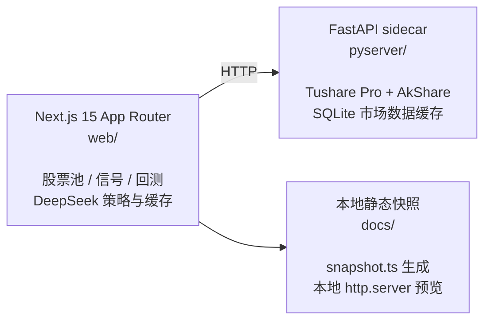

# topkyo · AI 基建研究台

**topkyo** 的个人私有研究仪表盘，聚焦 A 股 **AI 基建主题**：算力、互连、散热、电力、IDC、存储、半导体设备与材料等供给链。

> 私有仓库 · 仅供本人与授权协作者使用 · **不构成任何投资建议**

## 投资主题

研究视角沿用「硅基文明消费」框架：AI 算力体为了存在与扩张需要持续消耗的基础设施与材料，而非人类消费品。覆盖方向包括：

- 算力芯片、AI 服务器、云计算与 IDC
- 光模块、高速互连、高速 PCB、HBM/存储
- 液冷散热、电力、绿电与核电
- 半导体设备、材料、晶圆代工与相关制造链

## 功能

- **股票池**：按子主题维护 A 股标的（[`web/data/universe.json`](web/data/universe.json)），支持 DeepSeek 刷新
- **实时行情与目标价**：Python sidecar 拉取现价、估值、分析师目标价与上涨空间
- **DeepSeek 策略信号**：实时信号页 + TypeScript 回测引擎
- **浏览器缓存**：首页行情缓存在 `localStorage`，TTL 24 小时
- **本地静态快照**：生成 [`docs/`](docs/) 供离线预览（不对外发布）

## 架构



品牌文案集中在 [`web/lib/site.ts`](web/lib/site.ts)。

## 快速开始

### 1. 启动 Python sidecar

```bash
cd pyserver
cp env.example .env
# 在 .env 中设置 TUSHARE_TOKEN
uv sync
uv run uvicorn main:app --port 8001 --reload
```

### 2. 启动 Next.js

```bash
cd web
npm install
cp env.example.txt .env.local
# 配置 LLM key 与 PYSERVER_URL
npm run dev
```

打开 <http://localhost:3000>。

`web/.env.local` 示例见 [`web/env.example.txt`](web/env.example.txt)。

### 3. 刷新股票池（可选）

```bash
cd pyserver && uv run uvicorn main:app --port 8001 &
cd web && npx tsx scripts/refresh-universe.ts
```

### 4. 生成本地静态快照（可选）

```bash
cd pyserver && uv run uvicorn main:app --port 8001 &
cd web && npx tsx scripts/snapshot.ts
python3 -m http.server 8765 --directory docs
```

GitHub Pages：<https://topkyo.github.io/topkyo-ai-infra-dashboard/>（私有仓库需 GitHub Pro 才能启用；当前可用本地 `docs/` 预览）

跳过耗时的 LLM 步骤：

```bash
SNAPSHOT_SKIP_SIGNALS=1 SNAPSHOT_SKIP_BACKTEST=1 npx tsx scripts/snapshot.ts
```

## 数据与缓存

| 层 | 位置 | 用途 | TTL |
|---|---|---|---|
| 浏览器行情缓存 | `localStorage` | 首页现价与目标价 | 24 小时 |
| Python 市场数据缓存 | `pyserver/cache.db` | K 线、基本面、分析师 | 分层 TTL |
| LLM 回包缓存 | `web` SQLite | prompt+model 哈希 | 12 小时 |
| 回测信号缓存 | `web` SQLite | 历史调仓信号 | 长期复用 |

## 开发命令

| 目的 | 命令 |
|---|---|
| 启动 sidecar | `cd pyserver && uv run uvicorn main:app --port 8001 --reload` |
| 启动 Web | `cd web && npm run dev` |
| 类型检查 | `cd web && ./node_modules/.bin/tsc --noEmit` |
| 单元测试 | `cd web && npm test` |
| 生产构建 | `cd web && npm run build` |
| 刷新股票池 | `cd web && npx tsx scripts/refresh-universe.ts` |
| 刷新快照 | `cd web && npx tsx scripts/snapshot.ts` |

不要在同一工作区同时运行 `npm run dev` 和 `npm run build`。

停止本地服务：

```bash
lsof -ti:3000,8001 | xargs kill
```

## VPS 部署

若需远程访问完整交互功能，见 [`docs/DEPLOY.md`](docs/DEPLOY.md)（Docker Compose）。

## 安全

- **切勿**提交 `.env`、`.env.local`、`cache.db`、API key
- `TUSHARE_TOKEN` → `pyserver/.env`
- LLM key、`PYSERVER_URL` → `web/.env.local`
- 本仓库为 **private**，快照数据含策略输出，请勿公开分享

## 提交流程

线性历史；冲突用 rebase/cherry-pick；推送已重写分支用 `--force-with-lease`。
