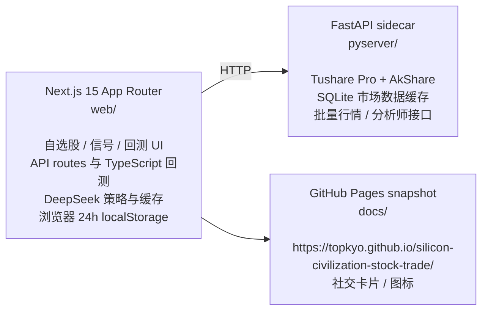

# 硅基文明消费股交易系统

一个面向中国市场的主题研究与交易仪表盘，聚焦 **硅基文明消费股**：AI 基础设施为了存在、扩张和迭代所持续消耗的算力、互连、散热、电力、IDC、存储、半导体设备与材料等供给链。

静态快照站点：<https://topkyo.github.io/silicon-civilization-stock-trade/>

## 主题定义

“硅基文明消费”不是指人类购买 AI 产品，而是假设人工智能形成基于硅的文明后，它们自身为了运行和扩张所需要消费的东西。系统做多这些“喂养”硅基文明的卖铲人：

- 算力芯片、AI 服务器、云计算与 IDC 数据中心
- 光模块、高速互连、高速 PCB、HBM/存储
- 液冷散热、电力、绿电与核电
- 半导体设备、材料、晶圆代工与相关制造链

## 功能

- 主题股票池：按子主题维护 A 股标的，数据源为 `web/data/universe.json`。
- 实时行情与目标价：从本地 Python sidecar 拉取现价、估值、分析师目标价和上涨空间。
- DeepSeek 策略信号：支持实时信号页和 TypeScript 回测引擎。
- 前端加载体验：从 pyserver 拉取行情时显示进度条，并把行情/分析师数据缓存在浏览器 `localStorage` 中，TTL 为 24 小时。
- 静态快照：生成 `docs/` 下的 GitHub Pages 静态页面，包含社交卡片、站点图标和自定义域名。

## 架构



## 数据与缓存

| 层 | 位置 | 用途 | TTL |
|---|---|---|---|
| 浏览器行情缓存 | `localStorage` | 首页现价与目标价批量加载结果 | 24 小时 |
| Python 市场数据缓存 | `pyserver/cache.db` | K 线、基本面、现价、分析师数据 | 分层 TTL |
| DeepSeek 回包缓存 | `web` SQLite cache | `sha256(prompt+model)` 对应的大模型响应 | 12 小时 |
| 回测信号缓存 | `web` SQLite cache | 已命中的历史调仓信号 | 长期复用 |

pyserver 当前数据源策略：

- `/klines`：A 股优先 Tushare `pro_bar`，港股使用 AkShare 港股历史行情。
- `/fundamental`：A 股优先 AkShare 东方财富快照，失败后回退 Tushare `daily_basic`。
- `/analyst` 与 `/analysts`：优先 AkShare 研报/盈利预测，失败后回退 Tushare `report_rc`。
- `/spot` 与 `/spot/batch`：A 股优先 AkShare 东方财富快照，港股使用 AkShare 港股历史行情，失败后回退 Tushare 日线。

## 快速开始

### 1. 启动 Python sidecar

```bash
cd pyserver
cp env.example .env
# 在 .env 中设置 TUSHARE_TOKEN
uv sync
uv run uvicorn main:app --port 8001 --reload
```

### 2. 启动 Next.js Web App

```bash
cd web
npm install
cp env.example.txt .env.local
# 在 .env.local 中设置 DEEPSEEK_API_KEY、DEEPSEEK_BASE_URL、PYSERVER_URL
npm run dev
```

打开 <http://localhost:3000>。

`web/.env.local` 示例：

```bash
DEEPSEEK_API_KEY=sk-...
DEEPSEEK_MODEL=deepseek-v4-pro
DEEPSEEK_MODEL_BACKTEST=deepseek-v4-flash
DEEPSEEK_BASE_URL=https://api.deepseek.com
PYSERVER_URL=http://localhost:8001
```

## 静态快照

静态站点发布自 `docs/`，通过 GitHub Pages 托管于 `https://topkyo.github.io/silicon-civilization-stock-trade/`。若需自定义域名，在 `docs/CNAME` 写入域名并在 DNS 配置 GitHub Pages 记录。

生成快照：

```bash
cd web
npx tsx scripts/snapshot.ts
```

如果只想快速刷新股票池静态页，可以跳过信号和回测：

```bash
cd web
SNAPSHOT_SKIP_SIGNALS=1 SNAPSHOT_SKIP_BACKTEST=1 npx tsx scripts/snapshot.ts
```

本地预览：

```bash
python3 -m http.server 8765 --directory docs
```

## 目录结构

```
silicon-civilization-stock-trade/
├── docs/                      # GitHub Pages 静态快照、图标、社交卡片
├── pyserver/                  # FastAPI + Tushare Pro/AkShare sidecar
│   ├── main.py
│   ├── env.example
│   ├── pyproject.toml
│   └── uv.lock
└── web/                       # Next.js 15 App Router
    ├── app/
    │   ├── page.tsx
    │   ├── signals/page.tsx
    │   ├── backtest/page.tsx
    │   └── api/
    │       ├── analyst/batch/route.ts
    │       ├── spot/batch/route.ts
    │       └── backtest/route.ts
    ├── data/universe.json     # 可编辑股票池
    ├── lib/
    │   ├── universe.ts
    │   ├── pyserver.ts
    │   ├── deepseek.ts
    │   ├── backtest.ts
    │   └── cache.ts
    └── test/
```

## 开发命令

| 目的 | 命令 |
|---|---|
| 启动 sidecar | `cd pyserver && uv run uvicorn main:app --port 8001 --reload` |
| 启动 Web dev server | `cd web && npm run dev` |
| 类型检查 | `cd web && ./node_modules/.bin/tsc --noEmit` |
| 单元测试 | `cd web && npm test` |
| 生产构建 | `cd web && npm run build` |
| Python 语法检查 | `python3 -m py_compile pyserver/main.py` |
| 刷新静态快照 | `cd web && npx tsx scripts/snapshot.ts` |

不要在同一个工作区里同时运行 `npm run dev` 和 `npm run build`，否则 `.next` 产物可能互相干扰。需要构建前先停止 dev server。

停止本地服务：

```bash
lsof -ti:3000,8001 | xargs kill
```

## 安全与配置

- 不要提交 `.env`、`.env.local`、`cache.db`、`.cache/`、`.next/`、`node_modules/` 或任何 API key。
- `TUSHARE_TOKEN` 仅放在 `pyserver/.env`。
- `DEEPSEEK_API_KEY`、`DEEPSEEK_BASE_URL`、`PYSERVER_URL` 仅放在 `web/.env.local`。
- 对外文档和默认配置不要写入私有服务器地址、真实 token 或临时调试 URL。

## 提交流程

本仓库要求线性历史。处理冲突时使用 rebase 或 cherry-pick，推送已重写分支时使用 `--force-with-lease`；不要引入 merge commit。
